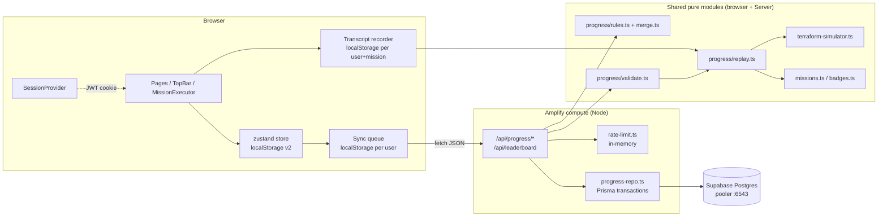

# Design: Progress sync, signed-in state, shared leaderboard

## Overview

Move progress from localStorage-only to Supabase, keyed by the GitHub account. The browser keeps the zustand store for instant gameplay. The Server is the source of truth for XP, completions and badges, and accepts a completion only after it replays the mission Transcript itself (R4, R5). Anonymous play keeps working exactly as today, entirely from localStorage; sign-in is required only to save to the Server and to appear on the leaderboard. Old local progress is merged once on first sign-in (R7). The leaderboard is computed on the Server from Verified completions only (R9).

What the code looks like today (checked):
- `src/lib/terraform-simulator.ts` and `src/data/missions.ts` are pure TS. `missions.ts` imports only `type Mission` and `resourceType` from `src/lib/providers.ts` (also pure). No `window`, `localStorage`, `Date.now` or React. **They can be imported by route handlers as-is; no split needed.**
- The simulator's only nondeterminism is `Math.random` inside `generateId()`. No objective `check` reads resource `id`s or output values. Checks use `applied`, `initialized`, `appliedResources.length/type`, `Object.keys(outputs)`, the HCL text and the command history.
- `MissionExecutor` re-checks objectives on every change of `simState`, `hcl` **or** `commandHistory`. An objective can latch from an HCL edit alone, without a command. "Reset terminal" clears sim state and history but keeps latched objectives. The Transcript format has to capture both (see Replay).
- `auth.ts` imports `PrismaAdapter` + `pg`. There's no `middleware.ts`, and this design doesn't add one (no page is force-protected); the adapter-free `auth.config.ts` is split out only so server-component `auth()` calls stay lean and adapter concerns stay in `auth.ts`.
- No `zod`, no test framework. `@@unique([profileId, missionId])` and `@@unique([profileId, badgeId])` already exist.

## Architecture



File layout (new unless noted):

| Path | Runs on | Purpose |
|---|---|---|
| `src/lib/progress/types.ts` | both | `Transcript`, `TranscriptStep`, `ProgressDTO`, `LocalProgressDTO`, `StatsDelta` |
| `src/lib/progress/validate.ts` | both | Hand-written validators for request bodies (no zod) |
| `src/lib/progress/replay.ts` | both | `replay(mission, transcript, random)` |
| `src/lib/progress/rules.ts` | both | `derivedXp`, `verifiedXp`, `isUnlocked`, `applyCompletion`, `applyStats` |
| `src/lib/progress/merge.ts` | both | `mergeProgress(server, local)` (pure) |
| `src/lib/progress/rng.ts` | both | `mulberry32(seed)` |
| `src/lib/auth.config.ts` | node | NextAuth config without adapter (for `auth()` in server components / API) |
| `src/lib/auth.ts` (changed) | node | `NextAuth({ ...authConfig, adapter })` |
| `src/lib/server/http.ts` | node | `readJsonLimited`, `jsonError`, `requireUser` |
| `src/lib/server/rate-limit.ts` | node | Fixed-window limiter (R10) |
| `src/lib/server/progress-repo.ts` | node | Load snapshot, write diffs in a transaction |
| `src/lib/server/leaderboard.ts` | node | `getLeaderboard(viewerUserId?)` |
| `src/app/api/progress/route.ts` | node | `GET` (load / create Profile), `PATCH` (provider, stats, mission activity) |
| `src/app/api/progress/complete/route.ts` | node | `POST` completion |
| `src/app/api/progress/merge/route.ts` | node | `POST` merge |
| `src/app/api/leaderboard/route.ts` | node | `GET` public leaderboard |
| `src/components/providers/AppProviders.tsx` | client | `SessionProvider` + `SyncManager` |
| `src/lib/sync/queue.ts`, `src/lib/sync/SyncManager.tsx` | client | Pending-change queue, backoff, hydrate, merge trigger |
| `src/lib/sync/transcript-store.ts` | client | Recorder persistence |

The pure modules hold all the decision logic, so they get the property tests. The route handlers stay thin: authenticate, rate limit, parse, call a pure function, persist.

## Components and Interfaces

### Shared simulator change (determinism)

`executeCommand(input, state, hcl, opts?: { random?: () => number })`. `random` is passed through to `generateId()` and defaults to `Math.random`, so browser behaviour stays the same. Replay on the Server passes `mulberry32(0)`. Replay outcomes don't depend on the IDs (no check reads them). Property 2 tests this with arbitrary random sources, so a future check that reads an ID fails the test.

### Transcript

```ts
type TranscriptStep = {
  command: string;              // "" allowed for check/reset steps
  hcl: string;                  // editor HCL at that moment
  kind?: "run" | "check" | "reset"; // default "run"
};
type Transcript = { provider: Provider; steps: TranscriptStep[] };
```

`kind` refines R4's `{ command, hcl }` without breaking it (omitted = `run`). It's needed because the browser can latch an objective without a command, and reset the terminal mid-attempt:
- `run`: a command was executed (also an empty command, which the browser pushes to history too).
- `check`: an objective latched from an HCL edit (or on mount, from the starter code). The recorder appends this only when a latch happens and the current HCL differs from the last recorded step's HCL, or when there are no steps yet.
- `reset`: the user pressed "Reset terminal" (sim state and history cleared, latches kept).

Recorder (`MissionExecutor` + `transcript-store.ts`):
- Key `terraops:transcript:<userId>:<missionId>` → `{ provider, steps, startedAt }`.
- On mount with a saved Transcript, the executor rebuilds `simState`, `commandHistory`, latched objectives and the last HCL by running the same `replay` locally. A reload resumes the same attempt, and the browser's state stays consistent with what the Server will replay (R4.2).
- New attempt (new, empty Transcript): the "Restart mission" button (new, clears latches too), "Replay to verify", or a provider change mid-attempt (the Transcript provider is fixed per attempt).
- Limits are mirrored client-side. At 300 steps, or if an HCL is over 64 KB, the executor shows "Attempt too long, restart to earn credit" and stops recording.
- Deleted when the Server returns 200 for that mission's completion (R4.4). Kept on 4xx (R8.4).

### Replay (`progress/replay.ts`)

```ts
function replay(mission: Mission, t: Transcript, random = mulberry32(0)): Set<string> {
  let state = createInitialState();
  let history: string[] = [];
  const latched = new Set<string>();
  for (const step of t.steps) {
    const kind = step.kind ?? "run";
    if (kind === "reset") { state = createInitialState(); history = []; }
    else if (kind === "run") {
      state = executeCommand(step.command, state, step.hcl, { random }).newState;
      history = [...history, step.command];
    }
    for (const o of mission.objectives)               // latch: once passed, never re-checked
      if (!latched.has(o.id) && o.check(state, step.hcl, history, t.provider)) latched.add(o.id);
  }
  return latched;
}
```

This matches the executor's order. `handleCommand` updates state and history, then the effect runs checks against `(newState, hcl, newHistory)`. Accept iff `latched.size === mission.objectives.length`. Cost is at most 300 steps × ~5 checks × a regex parse of ≤64 KB, well under a second. Each `check` is wrapped in try/catch, and a throw counts as "not passed".

### Rules (`progress/rules.ts`)

```ts
type Completion = { missionId: string; completedAt: Date; verified: boolean; verifiedAt: Date | null };
type Snapshot = { completions: Map<string, Completion>; badges: Set<string>;
                  inProgress: Map<string, InProgressRow>; stats: Stats; provider: Provider | null };

missionXp(id)        = mission.xpReward + (badge(mission.badgeId)?.xpBonus ?? 0)
derivedXp(s)         = Σ missionXp over s.completions               // badges are exactly the completed missions' badgeIds
verifiedXp(s)        = Σ missionXp over completions with verified
level(xp)            = getLevelInfo(xp).currentLevel.level           // LEVEL_THRESHOLDS
isUnlocked(id, s)    = id === "mission-01" || MISSIONS.some(m => s.completions.has(m.id) && m.unlocks?.includes(id))
applyCompletion(s, id, now) → s'
  - not completed:        add { completedAt: now, verified: true, verifiedAt: now }, add catalog badgeId
  - completed, unverified: verified = true, verifiedAt = now; completedAt and badges unchanged
  - completed, verified:  s unchanged
```

The badge XP comes from the mission's own `badgeId` (R5.7), which is the same total the client's `completeMission` computes today. Chapter badges (`badge-all-chapter*`, streaks, etc.) are never awarded by the Server, because no mission lists them as `badgeId`. Local copies of them are dropped by the merge filter.

### Merge (`progress/merge.ts`)

`mergeProgress(server: Snapshot, local: LocalProgressDTO, now): Snapshot`, pure:

1. `localDone` = local completed mission IDs that are in the catalog. `completedAt` comes from the local value, clamped to `[2024-01-01, now]` (missing → `now`).
2. Completions: for each id in `server ∪ localDone`:
   - Only on the Server: keep it.
   - Only local: `{ completedAt: local, verified: false, verifiedAt: null }`.
   - Both: keep the Server row, `completedAt = min(server, local)`. `verified`/`verifiedAt` unchanged.
3. Badges = `(server.badges ∪ local.badges) ∩ { m.badgeId | m completed after step 2 }`.
4. Stats: `max` per field, each clamped to `[0, STAT_MAX]` (`STAT_MAX = 1_000_000`).
5. In-progress: local in-progress catalog missions that aren't completed and have no Server row are added. `completedObjectives` is filtered to that mission's objective IDs. It's display-only and never used for completion.
6. Provider: `server.provider ?? validProvider(local.provider) ?? null`.
7. XP and level are recomputed with `derivedXp`. Local XP is ignored.

There's no unlock check and no Replay (R7.4). Every step is a union, min, max or filter, so `merge(merge(s, l), l) = merge(s, l)` (Property 7).

Client-side decision (`SyncManager`), after the session is known:

```
owner  = store.ownerUserId           // new field, store version 1 → 2 (migrate: undefined)
marker = localStorage["terraops:merged:<userId>"] === "1"
if owner === undefined && !marker && hasLocalProgress  → enqueue merge(local)
else if owner !== undefined && owner !== userId         → discard local, no merge (R7.8)
then GET /api/progress → hydrate store, set ownerUserId = userId
```

On merge 200: replace the store with the response, set `ownerUserId`, write the marker. On failure the store and marker stay untouched and the merge is retried next load (R7.7). Sign out keeps `ownerUserId`, so a different user signing in next never merges the first user's synced data.

### Client sync (`src/lib/sync`)

- **Session wiring.** The root `layout.tsx` calls `await auth()` (JWT decode, no DB hit) and renders `<AppProviders session={session}>`, which wraps `SessionProvider` (from `next-auth/react`) and `SyncManager`. Seeding the session avoids a signed-out flash in the TopBar.
- **TopBar (R1).** `useSession()`. When signed in, it shows an avatar `` plus the display name in a `<button aria-label="Account menu for {name}">`. The menu contains a "Sign out" `<button>` → `signOut({ redirectTo: "/" })`. When signed out, it shows `<Link href="/login">Sign in</Link>`. Native elements give keyboard support. The menu closes on Escape, with a visible focus ring. The sync indicator ("Not saved, retrying…", "Session expired, sign in again") is a `role="status" aria-live="polite"` span.
- **Store changes (`store.ts`).** Add `version: 2`, `ownerUserId?: string`, `MissionProgress.verified?: boolean`, `hydrate(dto, userId)`. Existing actions stay optimistic so gameplay is instant and works offline (R8.6). Each one also calls `queue.enqueue(...)` when signed in:
  - `completeMission` → `{ type: "complete", missionId }`. The Transcript is read from the transcript store at send time, not copied into the queue.
  - `incrementStats` → coalesced into one pending `stats` delta (counts summed).
  - `setProvider` → last-write `provider`.
  - The mission start in `MissionPageClient` → `missionActivity { missionId, started: true }`, coalesced with the hint and command deltas for that mission.
- **Queue (`queue.ts`).** Persisted at `terraops:pending:<userId>`. It sends one request at a time, in order: merge, then completes, then PATCH. Retries use backoff `min(60s, 1s·2^n) ± 20%` jitter, and also fire on `online`, `visibilitychange→visible` and page load. Status handling:

| Response | Action |
|---|---|
| 200 | Drop the op, `hydrate(response)`, delete the Transcript if it was a complete |
| network error / 5xx | Keep, backoff, show "Not saved, retrying" |
| 401 | Keep all ops, pause the queue, show the sign-in prompt |
| 429 | Keep, retry after `Retry-After` seconds |
| 400 / 409 / 413 / 422 | Drop the op, `GET /api/progress` → hydrate, toast with `error.message`, keep the Transcript |

  Resending is safe because complete and merge are idempotent (R5, R7). Stats deltas are only removed from the queue after a 200. A delta that's lost after the Server applied it but before the client saw the 200 can double-count once. Stats are cosmetic and excluded from XP and the leaderboard (accepted, see Risks).
- **Unverified UI (R7.9).** `MissionCard` and the mission page header show an "Unverified" pill (`aria-label="Completed offline, not verified"`) and a "Replay to verify" button. It starts a new attempt with an empty Transcript and clears the executor's latches. `alreadyCompletedRef` is false in verify mode, so the completion is submitted.
- **Pages.** Every page renders anonymously. `dashboard`, `achievements` and `missions/[id]` drop their `router.replace("/")`: when signed out they render straight from the local store (no skeleton gate, no redirect); when signed in they render the store and `SyncManager` hydrates it from the Server. `/missions` and `/missions/[id]` play anonymously from the store, with locked/available status derived from local completions. "Start" links straight to `/missions/<id>` (no login gate). The landing page keeps its existing anonymous username/start flow; the "Sign in with GitHub" affordance lives in the TopBar (R1). Signing in later merges the local data (R7).

### Routing and sign-in (R2)

The `auth.config.ts` split stays, because `auth.ts`'s `auth()` (used by the root `layout.tsx`, the `/login` server component and the leaderboard page) still needs the adapter-free config, and because API handlers call `requireUser()`/`auth()`. `auth.config.ts` holds `providers: [GitHub]`, `pages`, `session: { strategy: "jwt" }`, `secret`, `trustHost`, and the `jwt`/`session`/`redirect` callbacks. No adapter, no Prisma. `auth.ts` spreads it and adds `PrismaAdapter(prisma)`.

No page is force-protected: every route renders anonymously, so there's no redirect-to-login. The only redirect left is "signed-in user visiting `/login` → `/dashboard`". A whole edge middleware for that single redirect is overkill, so **there is no `middleware.ts`**. Instead the `/login` server component handles it:

```ts
// src/app/login/page.tsx (server component)
export default async function LoginPage() {
  const session = await auth();
  if (session?.user) redirect("/dashboard");   // R2: signed-in → /dashboard
  return <LoginClient />;                        // "Sign in with GitHub"
}
```

- `/`, `/missions`, `/missions/[id]`, `/dashboard`, `/achievements`, `/leaderboard` all render for everyone. API routes under `/api/*` return a JSON 401 themselves when there's no session (R3); anonymous play never calls them.
- `safeCallback(raw)`: accept only strings that start with `/`, don't start with `//` or `/\`, and contain no control chars. Otherwise use `/dashboard`. It's used by the TopBar / login page (`signIn("github", { redirectTo })`, so a user who starts sign-in from a page returns to it) and the NextAuth `redirect` callback (Property 11).
- In the `jwt` callback on sign-in, `token.id = user.id` and `token.login = profile.login` (GitHub login, used for the username).

### Progress API

All handlers use `export const runtime = "nodejs"` and `dynamic = "force-dynamic"`. The pipeline is the same for every write: `requireUser()` → 401 · `rateLimit(userId)` → 429 · `readJsonLimited(req, 1 MB)` → 413/400 · validate → 400/413 · domain checks → 409/422 · transaction → 200. The user is only ever `session.user.id`. Body fields named `userId`, `profileId`, `xp`, `level`, `badges`, `verified` are ignored (validators copy known fields only).

`readJsonLimited` rejects on `Content-Length > 1 MB`, then reads the stream counting bytes and aborts past 1 MB (413). `JSON.parse` failure → 400.

Error body: `{ "error": { "code": "UNKNOWN_MISSION" | "LOCKED" | "NOT_PASSED" | "TOO_LARGE" | "INVALID" | "RATE_LIMITED" | "UNAUTHENTICATED", "message": string } }`.

**`ProgressDTO`** (every 200 response except the leaderboard):

```ts
{
  profile: { username: string; image: string | null; xp: number; level: number; title: string;
             verifiedXp: number; provider: Provider | null;
             stats: { totalCommands; terraformApplies; hintsUsed; missionsAttempted; streakDays } };
  missions: Record<string, {           // locked missions omitted (same as the store today)
    status: "available" | "in_progress" | "completed";
    verified: boolean; completedAt: string | null; startedAt: string | null;
    hintsUsed: number; commandCount: number; completedObjectives: string[] }>;
  badges: string[];
}
```

`available` is derived (`isUnlocked` and no row). It isn't stored.

| Endpoint | Body | Success | Errors |
|---|---|---|---|
| `GET /api/progress` | none | 200 `ProgressDTO`. Creates the Profile (username from `token.login` → `name` → `"agent"`) if missing (R6.1) | 401 |
| `POST /api/progress/complete` | `{ missionId: string, transcript: Transcript }` | 200 `ProgressDTO` (also for repeats, R5.8) | 400 malformed / unknown mission or provider, 401, 409 locked, 413 body > 1 MB / > 300 steps / step `hcl` > 64 KB, 422 not all latched, 429 |
| `POST /api/progress/merge` | `{ local: LocalProgressDTO }` (the store's `profile` + `missionProgress`, ≤ 1 MB) | 200 `ProgressDTO` | 400, 401, 413, 429 |
| `PATCH /api/progress` | `{ provider?: Provider, stats?: StatsDelta, missionActivity?: { missionId, started?: true, hints?: int, commands?: int } }` | 200 `ProgressDTO` | 400, 401, 429 |
| `GET /api/leaderboard` | none (session optional) | 200 `LeaderboardDTO` | none |

Validation rules (`validate.ts`):
- The Transcript limits are checked before shape errors: more than 300 steps, or any step `hcl` over 64 KB, is 413. Then a non-array `steps`, a non-string `command`/`hcl`, an unknown `kind` or a provider outside `"aws"|"gcp"|"azure"` is 400. Then a `missionId` not in `MISSIONS` is 400 `UNKNOWN_MISSION`.
- `StatsDelta`: optional `totalCommands ≤ 500`, `terraformApplies ≤ 100`, `hintsUsed ≤ 100`, `missionsAttempted ≤ 20`. Each must be an integer ≥ 0. Anything else is 400. `streakDays` isn't client-writable. The Server sets it on each write: same UTC day unchanged, previous day +1, older reset to 1.
- `missionActivity`: catalog mission, `hints ≤ 100`, `commands ≤ 500`. It upserts a row with `status = "in_progress"` only if the mission isn't completed and is unlocked (otherwise ignored, not an error).

### Idempotency and concurrency (`progress-repo.ts`)

`POST complete` runs inside `prisma.$transaction(async tx => …)` (interactive transactions work through the Supabase transaction pooler):

1. `tx.missionProgress.upsert({ where: { profileId_missionId }, create: { status: "available" }, update: {} })`. The row now exists, and the `@@unique` blocks duplicate inserts.
2. `updateMany({ where: { profileId, missionId, status: { not: "completed" } }, data: { status: "completed", completedAt: now, verified: true, verifiedAt: now } })`.
3. If 0 rows: `updateMany({ where: { …, status: "completed", verified: false }, data: { verified: true, verifiedAt: now } })` (the verify-unverified case, R5.9).
4. `unlockedBadge.createMany({ data: [{ profileId, badgeId }], skipDuplicates: true })`.
5. Reload the completion rows, recompute `xp`/`level` with `derivedXp`, and update the Profile.

The conditional `updateMany` statements take a row lock. A concurrent duplicate waits, then matches 0 rows, so `completedAt`, badges and XP are written once. Step 5 always recomputes from the full set, so the last committer writes the correct total. Replay runs **before** the transaction, so nothing is held open during CPU work.

`POST merge`: load the Snapshot, call `mergeProgress`, then write the diff in one transaction (upserts by the unique keys, `createMany skipDuplicates` for badges, Profile update). Stats use `GREATEST` semantics via the computed max values.

### Rate limiter (`rate-limit.ts`, R10)

```ts
const WINDOW_MS = 60_000, LIMIT = 30;
const hits = new Map<string, { start: number; count: number }>();
export function rateLimit(userId: string, now = Date.now()): { ok: true } | { ok: false; retryAfter: number }
```

It's a fixed window per `userId`, applied to `POST complete`, `POST merge` and `PATCH /api/progress`. It runs after `requireUser` and before body parsing, so a 429 changes nothing. `Retry-After = ceil((start + WINDOW_MS - now) / 1000)`. When the map grows past 10k entries, expired entries are swept. It's per Lambda instance and best-effort (R10.3).

### Leaderboard (`leaderboard.ts`, R9)

```ts
type LeaderboardEntry = { rank: number; name: string; avatarUrl: string | null;
                          verifiedXp: number; level: number; title: string; verifiedCount: number };
type LeaderboardDTO = { entries: LeaderboardEntry[]; me: (LeaderboardEntry & { inTop: boolean }) | null };
```

1. One query: `profile.findMany({ select: { id, userId, username, user: { select: { image: true } }, missionProgress: { where: { verified: true, status: "completed" }, select: { missionId, verifiedAt } } } })`. Prisma `select` is explicit, so no email, tokens or User/Account fields are loaded.
2. In JS: `verifiedXp` = Σ `missionXp` over the verified rows, `lastVerifiedAt` = max `verifiedAt`. Profiles with 0 verified XP are excluded.
3. Sort by `verifiedXp` desc, then `lastVerifiedAt` asc (reached that XP earlier = higher), then `username` asc for a stable order. Assign `rank = index + 1`.
4. `entries` = the top 100, mapped to `LeaderboardEntry` (a whitelist mapper). `me` = the viewer's entry from the full sorted list (rank even outside the top 100), or `null`.

The `/leaderboard` page becomes a server component that calls `getLeaderboard((await auth())?.user?.id)` and highlights `me` (`aria-current="true"` on that row). If `me` isn't in the top 100, a separated row is shown at the bottom. The demo data is removed. The query is O(profiles), which is fine at hackathon scale (see Risks).

## Data Models

### Prisma schema diff (all additive)

```diff
 model Profile {
   ...
   missionsAttempted Int      @default(0)
+  provider          String?  // "aws" | "gcp" | "azure", validated in code against Provider
   createdAt         DateTime @default(now())
   ...
 }

 model MissionProgress {
   ...
   completedObjectives String[]  @default([])
+  verified            Boolean   @default(false)
+  verifiedAt          DateTime?
   createdAt           DateTime  @default(now())
   ...
   @@unique([profileId, missionId])   // already present, used for upserts
 }
```

`UnlockedBadge @@unique([profileId, badgeId])` and `Profile.username @unique` already exist. No other constraints are needed.

Applying it: `npx prisma db push` against live Supabase, then `prisma generate`. The changes add one nullable column and two columns with defaults. Nothing is dropped or renamed, so `db push` doesn't need `--accept-data-loss`. **The task that runs this must stop and get Ruth's explicit approval first.** Rollback is dropping the three columns.

`MissionProgress.status` stays a `String` with values `"in_progress" | "completed"` (`"available"` only transiently in step 1 of complete). Existing rows: the Profile tables are unused today, so I expect them to be empty. The task will check with a count before pushing.

### Client storage keys

| Key | Content |
|---|---|
| `terraform-mastery-game` (v2) | Store + `ownerUserId`, `MissionProgress.verified` |
| `terraops:merged:<userId>` | `"1"` after a successful merge |
| `terraops:transcript:<userId>:<missionId>` | `{ provider, steps, startedAt }` |
| `terraops:pending:<userId>` | Queue ops |

### Username

`toUsername(base)`: keep `[A-Za-z0-9_-]`, trim to 32 characters, empty becomes `agent`. On a P2002 conflict, try `base-2` … `base-20`, then `base-<6 random hex>`. Profile creation is `upsert` by `userId`, so two concurrent first loads don't create two Profiles.

## Correctness Properties

*A property is a characteristic or behavior that should hold true across all valid executions of a system-essentially, a formal statement about what the system should do. Properties serve as the bridge between human-readable specifications and machine-verifiable correctness guarantees.*

Generators: random catalog missions, providers, and transcripts built from a command alphabet (`terraform init|validate|plan|apply -auto-approve|apply|destroy -auto-approve|output|state list|state show <addr>|show|fmt|workspace show|new x|select default`, `ls`, `""`). HCL comes from the mission's starter codes and its hint/solution snippets, with `check`/`reset` steps mixed in. Snapshots and local progress are random subsets of the catalog with random dates and stats.

### Property 1: Browser/Server parity

For any mission, provider and sequence of executor events (command, HCL edit, terminal reset), the set of objectives latched by the browser executor loop equals `replay(mission, recordedTranscript)`.

**Validates: Requirements 4.1, 4.2, 5.3, 5.4**

### Property 2: Replay ignores random IDs

For any mission, Transcript and any two random sources `r1`, `r2`, `replay(m, t, r1)` and `replay(m, t, r2)` return the same set.

**Validates: Requirements 5.5**

### Property 3: Transcript validation

For any well-formed Transcript within the limits, validation succeeds and returns an equal value. For any Transcript with more than 300 steps or a step `hcl` over 64 KB, it returns 413. For any otherwise malformed body (missing or non-string field, unknown provider/kind, non-catalog mission), it returns 400.

**Validates: Requirements 4.6, 4.7, 5.1**

### Property 4: Unlock rule

For any Snapshot and mission ID, `isUnlocked` is true iff the ID is `mission-01` or some completed mission (verified or not) lists it in `unlocks`.

**Validates: Requirements 5.2**

### Property 5: XP, level and badges are derived

For any Snapshot reachable through `applyCompletion` and `mergeProgress`, `xp = derivedXp(s)`, `level = getLevelInfo(xp).currentLevel.level`, and `badges ⊆ { m.badgeId | m completed }`, regardless of any client-sent XP, level, badge or verified values.

**Validates: Requirements 5.6, 5.7, 7.2**

### Property 6: Completion is idempotent and verify-only on unverified

For any Snapshot and unlocked mission, `applyCompletion(applyCompletion(s, id, t1), id, t2) = applyCompletion(s, id, t1)` for completed fields. If the mission was an Unverified completion, the result has `verified = true` with `completedAt`, `xp` and badges equal to the input.

**Validates: Requirements 5.8, 5.9**

### Property 7: Merge is idempotent

For any Server Snapshot and Local progress, `merge(merge(s, l), l) = merge(s, l)`.

**Validates: Requirements 7.5, 8.2**

### Property 8: Merge loses nothing

For any `s`, `l`, the merged completions equal `s.completions ∪ catalogIds(l.completed)`. Each `completedAt` is the minimum of the two sides. Every Verified completion in `s` stays verified. Local-only completions are unverified. Stats are the per-field max. Provider is `s.provider ?? l.provider`.

**Validates: Requirements 7.2, 7.4**

### Property 9: Verified XP excludes unverified

For any Snapshot, `verifiedXp(s) = derivedXp(s restricted to verified completions)`, and `verifiedXp(s) ≤ derivedXp(s)`.

**Validates: Requirements 7.3**

### Property 10: Stats deltas are bounded

For any `StatsDelta` input, validation accepts it iff every present field is an integer in `[0, cap]`. `applyStats` never decreases a stat.

**Validates: Requirements 5.10**

### Property 11: Callback URLs stay same-origin

For any string, `safeCallback(s)` is either `s` (when `s` starts with a single `/`, not `//` or `/\`, and has no control characters) or `/dashboard`.

**Validates: Requirements 2.2**

### Property 12: Leaderboard ranking

For any set of profiles, `entries` is sorted by `verifiedXp` desc, then `lastVerifiedAt` asc. It has length `min(100, n)`, ranks are `1..k`, each entry's keys are exactly the `LeaderboardEntry` fields, and `me.rank` equals the viewer's position in the full ordering.

**Validates: Requirements 9.1, 9.2, 9.3, 9.4**

### Property 13: Rate limit

For any sequence of request timestamps for one user, at most 30 are allowed in any fixed 60 s window. Every rejected one has `retryAfter ∈ [1, 60]`. Requests from other users don't affect the count.

**Validates: Requirements 10.1, 10.2**

### Property 14: Username uniqueness

For any base string and set of taken usernames, `pickUsername` returns a name not in the set that matches `^[A-Za-z0-9_-]{1,40}$`.

**Validates: Requirements 6.5**

## Error Handling

- Every handler is wrapped in try/catch. Unknown errors return 500 `{ error: { code: "INTERNAL" } }` and are logged with the user ID and route, never the body or the Transcript. The client treats 500 as retryable.
- A Prisma `P2002` during Profile creation is retried with the next username candidate. A `P2034` (serialization/deadlock) gets one retry, then 503.
- Replay exceptions inside a `check` count as "not passed", so the outcome is 422 rather than 500.
- An expired session in the middle of the queue gets 401: the queue pauses, the TopBar shows "Session expired, sign in again", and pending ops survive.
- Leaderboard DB failure: the page shows "Leaderboard unavailable, try again" and the API returns 503.
- Transcripts live only in the request (R4.8): they aren't logged or stored. The validated object is dropped after Replay.

## Testing Strategy

There's no test framework today. I'll add **`vitest@5.0.3`** and **`fast-check@4.10.2`** as devDependencies, pinned exactly. Both are current on npm as of writing, and the versions will be rechecked when the task runs. Add `vitest.config.ts` with `resolve.alias { "@": "./src" }`, `environment: "node"`, and a `"test": "vitest --run"` script. Tests live in `src/**/__tests__/*.test.ts`. They aren't added to `amplify.yml`, so the deploy build doesn't change.

**Property tests** (fast-check, `numRuns: 100` minimum, one test per property). Each one is tagged with a comment `// Feature: progress-sync, Property N: <title>`:
- `replay.test.ts`: P1 (parity, with a test harness that reproduces the executor loop exactly: command → state/history → checks; edit → checks; reset), P2.
- `validate.test.ts`: P3, P10.
- `rules.test.ts`: P4, P5, P6, P9.
- `merge.test.ts`: P7, P8 (and P5 for merged snapshots).
- `callback.test.ts`: P11. `leaderboard.test.ts`: P12, using a pure `rankProfiles()` split out of the query. `rate-limit.test.ts`: P13, with an injected clock. `username.test.ts`: P14.

**Unit / example tests:**
- Replay: each of the 15 catalog missions has a hand-written passing Transcript (golden solutions) that latches all objectives for each provider, and a truncated version that gets 422. This also guards against catalog edits breaking verification.
- Route handlers with `auth` and `prisma` mocked: 401 without a session for every endpoint, 429 on the 31st write, 413 by `Content-Length` and by streamed size, 409 for a locked mission, injected `userId`/`xp` fields being ignored.
- `/login` server component: signed-in → redirects to `/dashboard`; signed-out → renders the login client. No other route redirects.
- Sync queue: status table (200/5xx/401/429/4xx) with a fake `fetch`. Stats coalescing preserves totals. The merge decision (owner/marker/userId).

**Integration (manual, against a Supabase branch or local Postgres, not run in CI):** two concurrent `POST complete` for the same mission give one `completedAt` and the correct XP. Merge then complete for an unverified mission. A fresh Profile shows up on the leaderboard after a verified completion.

UI (TopBar, unverified pill, sync indicator) is covered by example tests and a keyboard-only manual pass. PBT doesn't fit rendering.

## Risks and open questions

- **Anonymous play stays (Ruth's decision).** Nothing is force-protected; signed-out users play from localStorage and `/dashboard` and `/achievements` show that local-only data. Sign-in is user-initiated from the TopBar and is required only to save to the Server and to appear on the leaderboard. Signing in later runs the R7 merge (local completions become unverified, then "Replay to verify"), so no local progress is lost by signing in.
- **Edit-only latches.** If a future objective depends on HCL state that's never captured, parity breaks. The `check` step covers today's executor. Property 1 plus the golden Transcripts catch regressions.
- **localStorage size.** Each Transcript stores the HCL per step. Typical attempts (10–40 steps × 2–5 KB) are fine. The 300 × 64 KB worst case exceeds the ~5 MB quota, so `setItem` failures are caught and the attempt is marked "too long, restart". Possible later improvement: store unchanged HCL by reference locally and expand before sending.
- **Stats double-count** after a lost 200 response. They're cosmetic and not part of XP or the leaderboard. Accepted.
- **Leaderboard cost** is O(profiles) per page load. Fine below ~10k profiles. Past that, denormalize `verifiedXp`/`lastVerifiedAt` onto `Profile` (outside R6's listed schema changes, so not done now).
- **Signed-out dashboard shows local-only data.** `/dashboard` and `/achievements` render Local progress when signed out. That data lives only in that browser's localStorage; signing in later merges it into the account (R7). No new env vars are needed (no middleware), and `AUTH_SECRET` is already in the `amplify.yml` allowlist for the server-side `auth()` calls.
- **Replay CPU on Lambda.** It's bounded by the 300-step and 64 KB limits and should take well under 1 s. To be measured with the worst-case golden test.
- **Hints remain an honest-player concern** (out of scope per the requirements).
